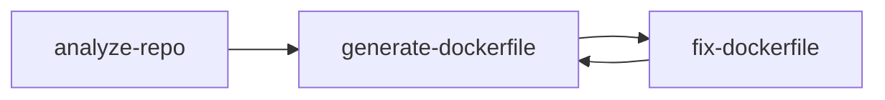

# Tool Design & Interaction Document

## Overview

This document provides a comprehensive design and interaction analysis of three core containerization tools: **analyze-repo**, **generate-dockerfile**, and **fix-dockerfile**. These tools form a cohesive workflow for analyzing repositories, generating optimized Dockerfiles, and fixing containerization issues.

## Tool Architecture

### Co-location Pattern

All three tools follow the co-location pattern established in the codebase:

```
src/tools/[tool-name]/
├── tool.ts      # Core implementation and logic
├── schema.ts    # Zod schema definitions and parameter validation
└── index.ts     # Public exports and type re-exports
```

This pattern provides:
- **Modularity**: Each tool is self-contained
- **Clean exports**: Tools export both implementation and schema
- **Easy deletion**: Tools can be removed by deleting their folder
- **Type safety**: Schema-driven parameter validation

### Core Dependencies

All tools share common dependencies:
- `@types` - Domain types and Result pattern
- `@lib/session` - Session state management
- `@lib/logger` - Structured logging with timing
- `@lib/mcp-host-ai` - AI enhancement capabilities
- `@config/defaults` - Default configurations and constants

## Tool Analysis

### 1. Analyze Repository Tool (`analyze-repo`)

**Purpose**: Analyzes repository structure to detect programming languages, frameworks, build systems, and provides containerization recommendations.

#### Core Functionality

```typescript
interface AnalyzeRepoConfig {
  sessionId: string;
  repoPath: string;
  depth?: number;
  includeTests?: boolean;
  usePerspectives?: boolean;
  perspective?: AnalysisPerspective;
  securityFocus?: boolean;
  performanceFocus?: boolean;
}
```

#### Detection Capabilities

1. **Language Detection**
   - Uses file extensions and signature files
   - Supports: JavaScript/TypeScript, Python, Java, Go, Rust, Ruby, PHP, .NET
   - Language signatures defined in `LANGUAGE_SIGNATURES` constant

2. **Framework Detection**
   - Checks for framework-specific files and dependencies
   - Supports: Express, Next.js, React, Django, Flask, Spring, Rails, etc.
   - Framework signatures in `FRAMEWORK_SIGNATURES` constant

3. **Build System Detection**
   - Identifies build tools and configuration files
   - Maps build/test commands for each system
   - Defined in `BUILD_SYSTEMS` constant

4. **Dependency Analysis**
   - Parses package.json, requirements.txt, pom.xml, etc.
   - Categorizes dependencies as production/development
   - Used for security recommendations

5. **Port Detection**
   - Uses framework-specific default ports
   - Falls back to language defaults from `DEFAULT_PORTS`

#### AI Enhancement

- Integrates with MCP Host AI for intelligent insights
- Provides contextual analysis based on detected stack
- Fallback to static analysis if AI unavailable

#### Output Structure

```typescript
interface AnalyzeRepoResult {
  ok: boolean;
  sessionId: string;
  language: string;
  framework?: string;
  buildSystem?: BuildSystemInfo;
  dependencies: DependencyInfo[];
  ports: number[];
  hasDockerfile: boolean;
  hasDockerCompose: boolean;
  hasKubernetes: boolean;
  recommendations: {
    baseImage: string;
    buildStrategy: string;
    securityNotes: string[];
  };
  metadata: AnalysisMetadata;
}
```

#### Session Integration

Updates workflow state with analysis results:
```typescript
const updatedWorkflowState = updateWorkflowState(currentState || {}, {
  analysis_result: { /* analysis data */ },
  completed_steps: [...steps, 'analyze-repo']
});
```

### 2. Generate Dockerfile Tool (`generate-dockerfile`)

**Purpose**: Generates optimized Dockerfiles based on repository analysis results.

#### Core Functionality

```typescript
interface GenerateDockerfileConfig {
  sessionId: string;
  baseImage?: string;
  runtimeImage?: string;
  optimization?: boolean;
  multistage?: boolean;
  securityHardening?: boolean;
  includeHealthcheck?: boolean;
  customInstructions?: string;
  optimizeSize?: boolean;
  customCommands?: string[];
}
```

#### Generation Strategy

1. **AI-Enhanced Generation**
   - Uses MCP Host AI for intelligent Dockerfile creation
   - Provides context-aware optimizations
   - Falls back to template-based generation

2. **Template-Based Generation**
   - Language-specific Dockerfile templates
   - Multi-stage build optimization for large dependency sets
   - Security hardening with non-root users

3. **Build Command Generation**
   - Language and build-system specific commands
   - Optimized layer caching strategies
   - Production vs development configurations

#### Multi-stage Build Logic

```typescript
// Uses multi-stage when:
if (options.multistage && deps.length > 5) {
  // Build stage for dependencies and compilation
  // Runtime stage for minimal production image
}
```

#### Security Features

- Non-root user creation (`appuser:1001`)
- Production-only dependencies
- Base image recommendations from security perspective
- Health check integration
- Security warnings detection

#### AI Integration Flow

1. **Context Preparation**
   ```typescript
   const context = {
     language: analysis.language,
     framework: analysis.framework,
     dependencies: analysis.dependencies,
     securityLevel: options.securityHardening ? 'strict' : 'standard',
     optimization: options.optimization ? 'balanced' : 'minimal',
     multistage: options.multistage !== false,
   };
   ```

2. **Prompt Generation**
   - Uses `createPromptTemplate('dockerfile', context)`
   - Includes requirements for best practices
   - Contextual to detected technology stack

3. **Response Processing**
   - Parses Dockerfile from AI response
   - Handles code blocks and structured responses
   - Validates generated content

#### Output Structure

```typescript
interface GenerateDockerfileResult {
  ok: boolean;
  sessionId: string;
  content: string;        // Generated Dockerfile content
  path: string;          // File path where written
  baseImage: string;     // Base image used
  optimization: boolean; // Whether optimization enabled
  multistage: boolean;   // Whether multi-stage used
  warnings?: string[];   // Security/best practice warnings
}
```

### 3. Fix Dockerfile Tool (`fix-dockerfile`)

**Purpose**: Analyzes and fixes Dockerfile build errors and issues.

#### Core Functionality

```typescript
interface FixDockerfileConfig {
  sessionId: string;
  error?: string;        // Build error to fix
  dockerfile?: string;   // Dockerfile content to fix
}
```

#### Fix Strategy

1. **Error Analysis**
   - Retrieves build errors from session state
   - Accepts specific error messages
   - Uses AI to analyze and understand issues

2. **AI-Powered Fixes**
   - Submits Dockerfile and error to MCP Host AI
   - Gets corrected Dockerfile with explanations
   - Handles various AI response formats

3. **Fallback Fixes**
   - Language-specific fallback patterns
   - Standard containerization best practices
   - Applies when AI unavailable

#### AI Integration Process

1. **Context Building**
   ```typescript
   const analysisContext = {
     error: buildError || 'No specific error provided',
     dockerfile: dockerfileToFix,
     operation: 'fix',
     focus: 'Analyze the Dockerfile and any build errors, then provide a corrected version',
   };
   ```

2. **Response Processing**
   - Extracts Dockerfile from code blocks
   - Handles JSON structured responses
   - Validates corrected Dockerfile format

3. **Fallback Generation**
   - Uses analysis results from session
   - Generates language-specific templates
   - Applies standard best practices

#### Output Structure

```typescript
interface FixDockerfileResult {
  ok: boolean;
  sessionId: string;
  dockerfile: string;    // Fixed Dockerfile content
  path: string;         // Output file path
  fixes: string[];      // List of applied fixes
  validation: string[]; // Validation results
}
```

## Tool Interaction Flow

### Sequential Workflow

The three tools are designed to work in sequence:



1. **analyze-repo** → Creates session with analysis results
2. **generate-dockerfile** → Reads analysis, generates Dockerfile
3. **fix-dockerfile** → Reads generated Dockerfile, fixes issues

### Session State Management

All tools share session state through the `SessionManager`:

```typescript
// Tool 1: analyze-repo stores results
await sessionManager.update(sessionId, {
  workflow_state: {
    analysis_result: { language, framework, dependencies },
    completed_steps: ['analyze-repo']
  }
});

// Tool 2: generate-dockerfile reads analysis, stores Dockerfile
const session = await sessionManager.get(sessionId);
const analysisResult = session.workflow_state?.analysis_result;
// ... generate dockerfile ...
await sessionManager.update(sessionId, {
  workflow_state: {
    dockerfile_result: { content, path },
    completed_steps: [...steps, 'generate-dockerfile']
  }
});

// Tool 3: fix-dockerfile reads Dockerfile, stores fixes
const dockerfileToFix = session.workflow_state?.dockerfile_result?.content;
// ... fix dockerfile ...
await sessionManager.update(sessionId, {
  workflow_state: {
    dockerfile_result: { content: fixedDockerfile },
    completed_steps: [...steps, 'fix-dockerfile']
  }
});
```

### Data Flow Dependencies

```
Repository Files
       ↓
  [analyze-repo]
       ↓
  Analysis Result
       ↓
[generate-dockerfile] ← Base Images Config
       ↓              ← Default Ports
  Dockerfile Content   ← Build Templates
       ↓
  [fix-dockerfile] ← AI Service
       ↓              ← Error Messages
  Fixed Dockerfile
```

## Shared Infrastructure

### Error Handling Pattern

All tools use the Result<T> pattern from `@domain/types`:

```typescript
import { Result, Success, Failure } from '@types';

// Success case
return Success({
  ok: true,
  sessionId,
  // ... tool-specific data
});

// Failure case  
return Failure('Error message explaining what went wrong');
```

### Current Type System

```typescript
export type Result<T> = { ok: true; value: T } | { ok: false; error: string };
export const Success = <T>(value: T): Result<T> => ({ ok: true, value });
export const Failure = <T>(error: string): Result<T> => ({ ok: false, error });
```

### Logging and Timing

All tools use structured logging with timing:

```typescript
const timer = createTimer(logger, 'tool-name');
try {
  // ... tool logic ...
  timer.end({ metadata });
  logger.info({ results }, 'Tool completed successfully');
  return Success(result);
} catch (error) {
  timer.error(error);
  logger.error({ error }, 'Tool execution failed');
  return Failure(error.message);
}
```

### AI Integration Pattern (New ToolContext)

All AI-capable tools use the new ToolContext pattern:

```typescript
export interface ToolContext {
  sampling: {
    createMessage(request: SamplingRequest): Promise<SamplingResponse>;
  };
  getPrompt(name: string, args?: Record<string, unknown>): Promise<PromptWithMessages>;
  signal?: AbortSignal;
  progress?: ProgressReporter;
}

// Tool execution pattern
export async function toolFunction(
  config: ToolConfig,
  logger: Logger,
  context?: ToolContext, // Optional for backward compatibility
): Promise<Result<ToolResult>> {
  if (context) {
    // Try AI-enhanced approach
    const { description, messages } = await context.getPrompt('prompt-name', args);
    const response = await context.sampling.createMessage({
      messages,
      includeContext: 'thisServer',
      modelPreferences: { hints: [{ name: 'code' }] },
    });
    // Process AI response with text-processing utils
  }
  
  // Fallback to template-based approach
  return generateFallbackResult();
}
```

## Configuration and Defaults

### Centralized Configuration

Tools rely on centralized configuration:

- `@config/defaults` - Default ports, network settings, container configs
- `@lib/base-images` - Recommended base images per language/framework
- Language signatures and framework detection rules

### Base Image Strategy

```typescript
const getRecommendedBaseImage = (language: string, framework?: string) => {
  // Security-focused, minimal base images
  // Framework-specific optimizations
  // Multi-stage build compatibility
};
```

### Port Configuration

```typescript
const DEFAULT_PORTS = {
  javascript: [3000, 8080],
  python: [8000, 5000],
  java: [8080, 8443],
  go: [8080],
  dotnet: [5000, 5001],
  // ...
};
```

## Security Considerations

### Non-Root Execution

All tools generate containers that:
- Create non-root user (`appuser`)
- Use appropriate UID/GID (1001)
- Switch to non-root before CMD

### Base Image Security

- Use official, minimal base images
- Pin specific versions (avoid :latest)
- Security-focused recommendations

### Dependency Management

- Production-only dependencies where possible
- Dependency vulnerability analysis
- Security recommendations in analysis

### Build Optimization

- Multi-stage builds for size optimization
- Layer caching for faster builds
- Minimal attack surface

## Extension Points

### Adding New Languages

1. Add language signature to `LANGUAGE_SIGNATURES`
2. Add framework mappings to `FRAMEWORK_SIGNATURES`
3. Add build system to `BUILD_SYSTEMS`
4. Add default ports to `DEFAULT_PORTS`
5. Add base image recommendations
6. Add build command templates

### Custom AI Providers

Tools can be extended to support different AI providers by:
1. Implementing `MCPHostAI` interface
2. Adding provider-specific prompt templates
3. Handling provider-specific response formats

### Additional Analysis Types

The analyze-repo tool supports perspective-based analysis:
- Security-focused analysis
- Performance-focused analysis  
- Comprehensive analysis with custom emphasis

## Best Practices

### Tool Implementation

1. **Always use Result<T>** for error handling
2. **Log with structured data** including timing
3. **Validate parameters** using Zod schemas
4. **Update session state** after successful operations
5. **Provide fallbacks** when AI services unavailable

### Session Management

1. **Check session exists** before processing
2. **Update incrementally** to preserve state
3. **Store structured data** for tool interoperability
4. **Include metadata** for debugging and analysis

### AI Integration

1. **Check availability** before making AI calls
2. **Provide clear context** in prompts
3. **Handle response parsing** gracefully
4. **Always have fallbacks** for template-based generation
5. **Validate AI output** before using

### Error Handling

1. **Use specific error messages** that guide users
2. **Log errors with context** for debugging
3. **Provide actionable feedback** when operations fail
4. **Clean up resources** on errors

## Testing Strategy

### Unit Testing

Each tool should have comprehensive unit tests covering:
- Happy path scenarios
- Error conditions
- AI integration (with mocks)
- Session state management
- Configuration variations

### Integration Testing

Test tool interactions:
- Sequential workflow execution
- Session state passing between tools
- Error recovery and retry logic
- AI service integration

### End-to-End Testing

Validate complete containerization workflows:
- Repository analysis → Dockerfile generation → Error fixing
- Different language/framework combinations
- AI-enhanced vs template-based generation
- Multi-environment configurations

## Future Enhancements

### Planned Improvements

1. **Caching Layer** - Cache analysis results and AI responses
2. **Parallel Processing** - Analyze multiple aspects concurrently
3. **Plugin Architecture** - Support custom analysis plugins
4. **Template Engine** - More sophisticated Dockerfile templating
5. **Validation Engine** - Advanced Dockerfile and container validation

### Extensibility

The current design supports:
- Adding new languages and frameworks
- Custom AI providers and prompt templates
- Additional analysis perspectives
- Custom containerization strategies
- Integration with external tools and services

## Conclusion

The three tools form a cohesive, intelligent containerization system that:
- Provides comprehensive repository analysis
- Generates optimized, secure Dockerfiles  
- Automatically fixes containerization issues
- Leverages AI for intelligent recommendations
- Maintains clean architecture and extensibility
- Follows established patterns and best practices

The co-location pattern, Result-based error handling, session state management, and AI integration create a robust foundation for containerization automation.